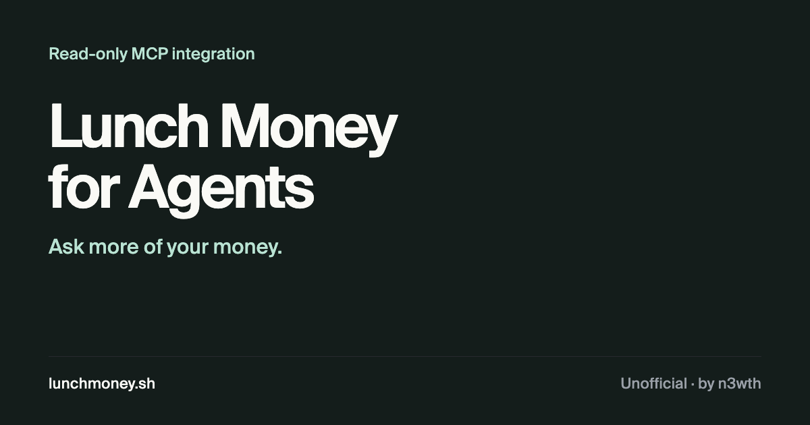

# Lunch Money for Agents

[](https://lunchmoney.sh)

**Ask your AI agent about your Lunch Money data.**

[Website](https://lunchmoney.sh) · [Setup guide](docs/user-guide.md) · [Privacy](https://lunchmoney.sh/privacy) · [Report an issue](https://github.com/n3wth/lunchmoney-mcp/issues)

I built this to make [Lunch Money](https://lunchmoney.app) easier to use with
AI agents. It connects your account to tools that support
[Model Context Protocol](https://modelcontextprotocol.io) (MCP), so you can
ask about your spending, budgets, accounts, and recurring expenses in conversation.

This is an unofficial, open-source MCP integration by [n3wth](https://n3wth.com).
It is not affiliated with, endorsed by, or sponsored by Lunch Money.

## What you can ask

- “Show my transactions from last week, grouped by category.”
- “How does this month's spending compare with my budget?”
- “List my recurring expenses.”
- “What are my account balances? Keep each currency separate.”

The integration gives your agent access to the underlying records; your agent
uses those results to answer. Financial access is read-only: it cannot edit
transactions, change budgets, or move money. Connection tools can link,
replace, or remove your connection to the service.

## Connect your account

You'll need a Lunch Money account, a personal access token, and an MCP client
that supports remote servers with OAuth sign-in.

1. **Add the server** using your client's setup instructions below.
2. **Sign in at `auth.n3wth.com`.** This creates your connector session,
   separate from your Lunch Money login.
3. **Ask your agent to connect Lunch Money.** It should run
   `lunchmoney_connect` and give you a browser link.
4. **Open the link and enter your token in Nango's connection page.** Create
   the token on [Lunch Money’s Developers page](https://my.lunchmoney.app/developers)
   by clicking **Request New Access Token** (label and usage are optional). Never paste it
   into chat or your MCP configuration.
5. **Try a small request**, such as “List my Lunch Money accounts.”

The hosted endpoint is:

```text
https://mcp.lunchmoney.sh/mcp
```

### Client-specific installation

Choose your app on the [website](https://lunchmoney.sh/#connect), or install
directly:

**Claude Code** — run inside Claude Code:

```text
/plugin marketplace add n3wth/lunchmoney-mcp
/plugin install lunchmoney@lunchmoney-mcp
```

**Codex** — run in a terminal:

```sh
codex plugin marketplace add n3wth/lunchmoney-mcp
codex plugin add codex-plugin@lunchmoney-mcp
```

For the Codex app, use **Plugins → Create menu → Add marketplace** with
`n3wth/lunchmoney-mcp`, then install **Lunch Money**.
For Cursor, select **Cursor → Add to Cursor** on the website.
Start a new session after installing, sign in, then ask “Connect Lunch Money”.

Custom marketplaces are separate from curated directory approvals.
Full instructions and manual alternatives:

| Client | Instructions |
| --- | --- |
| Codex | [Plugin and manual setup](packages/codex-plugin/README.md) |
| Claude Code | [Plugin setup](packages/claude-plugin/README.md) |
| Cursor | [Plugin and MCP configuration](packages/cursor-plugin/README.md) |
| Other MCP clients | [Connection guide](docs/user-guide.md) |

The hosted service is in beta. Direct setup is available; a directory submission
does not mean a plugin is approved or listed. See the
[submission record](docs/plugin-submissions.md) for review status and the
[runbook](docs/runbook.md) for outstanding release checks.

## Where your data goes

Signing in and connecting Lunch Money are separate steps:

| Service | Role |
| --- | --- |
| Auth0 | Signs you in at `auth.n3wth.com` and identifies your connector account. |
| Nango | Collects and stores your Lunch Money token through its browser flow. |
| Cloudflare | Runs the MCP server and stores identity and connection records. |
| Lunch Money | Returns the financial records requested through its API. |
| Your AI client | Receives the results and may send them to its model provider. |
| Vercel | Hosts the website and routes requests to the MCP server. |

The server retrieves your token from Nango when needed and enforces financial
reads only. Your token may have broader permissions in Lunch Money itself.
Financial responses are not saved in the connector's database, but your AI
client's privacy and retention settings still apply to the results it receives.

To disconnect, ask your agent to run `lunchmoney_disconnect`. If deletion fails,
retry until it succeeds. Revoke the original token in Lunch Money if you also
want to prevent its use elsewhere. Removing a client plugin does neither.

Read the [privacy notice](https://lunchmoney.sh/privacy) for storage, retention,
and provider details, and the [service terms](https://lunchmoney.sh/terms) before
connecting your account.

## A couple of things to watch

**Transactions arrive in pages.** One response may not cover the whole date
range. The agent needs to follow `next_offset` until it is `null` before
presenting a complete total.

**Currencies stay separate.** Adding USD and CAD amounts together does not
produce a useful total. Ask for separate totals unless you explicitly want a
conversion.

AI-generated answers can be wrong. Check the source records in Lunch Money
when an answer matters. The [user guide](docs/user-guide.md) lists the tools
and explains connection troubleshooting.

## Work on the project

Use Node.js 22 or later. The site is static HTML and CSS with a small React
conversation preview built from Vercel AI Elements.

```bash
git clone https://github.com/n3wth/lunchmoney-mcp.git
cd lunchmoney-mcp
npm ci
npm run preview
```

This serves the site at `http://localhost:4173`. To build it without starting
a server, run `npm run build`; the output goes into `dist/`.

Run the server checks in dependency order:

```bash
npm --prefix packages/auth-contract ci
npm --prefix packages/auth-contract test
npm --prefix packages/lunchmoney-adapter ci
npm --prefix packages/lunchmoney-adapter test
npm --prefix packages/server ci
npm --prefix packages/server test
node scripts/validate-release.mjs
```

| Directory | Contents |
| --- | --- |
| `site/` | Website, styles, and shared icons |
| `packages/` | MCP server, authentication contract, API adapter, and client plugins |
| `docs/` | Setup, operations, security, and submission records |
| `scripts/` | Release validation and smoke checks |

Staging and production use separate configurations and databases. Default
Worker commands target staging. Follow the [runbook](docs/runbook.md) for
deployment, credentials, migrations, and rollback.

## Contribute

Bug reports, clearer setup instructions, and compatibility fixes are welcome.
For a bug, include the client you used, what you expected, and a minimal example
with sample data. Leave tokens and personal financial records out of issues.

Open an issue before a larger change so we can agree on the scope. For a pull
request, explain the problem and how you checked the fix. Keeping financial
access read-only is a core constraint of this project.
