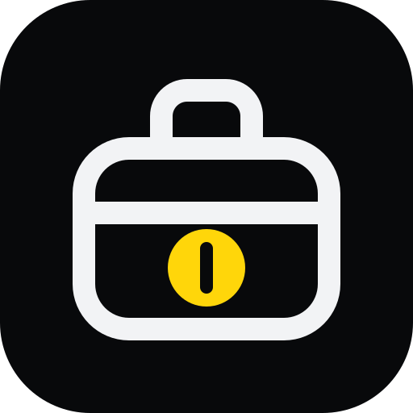

# Lunch Money MCP for Codex



Unofficial plugin for read-only Lunch Money data.

The package uses `.codex-plugin/plugin.json` with a companion `.mcp.json`.
Its package ID matches the directory (`codex-plugin`); its display name is
Lunch Money MCP. Plugin OAuth fields use camelCase;
manual TOML uses snake_case, as shown below.

## Manual config

This directory is plugin source, not a published marketplace listing. Install
through a Codex marketplace that includes this directory, then open a new task
to load the tools. Alternatively, configure the server manually below. Avoid
using both methods at once, which creates duplicate tool connections.

Equivalent `config.toml` entry:

```toml
mcp_oauth_callback_port = 1455

[mcp_servers.lunchmoney]
url = "https://mcp.lunchmoney.sh/mcp"

[mcp_servers.lunchmoney.oauth]
client_id = "xDAFMwYkwjC3GiWoKsrQvZaEqOg8sbxI"
callback_url = "http://127.0.0.1:1455/callback"
callback_port = 1455
```

The public client ID matches `oauth.clientId` in this package's `.mcp.json`.
The callback URI must exactly match the registered Auth0 URI. Port 1455 must be
available during login. This public OAuth client uses PKCE without a secret.

Let Codex discover the OAuth resource from the server metadata. In Codex CLI
0.154.0, also setting `oauth_resource` duplicates the authorization request's
resource parameter and Auth0 rejects it with `resource parameter must be a string`.

Run `codex mcp login lunchmoney --scopes lunchmoney:read,offline_access`.
Codex runs the OAuth flow (PKCE S256) against
`auth.n3wth.com`, then `lunchmoney_connect` returns a
Nango link to enter your Lunch Money token in a trusted browser page.
Never paste that token into chat or store it in plugin configuration.

## Verify

After install, `tools/list` must show only the `lunchmoney_*` tools; all
data tools are marked `readOnlyHint`.

Complete browser login, check `lunchmoney_connection_status`, connect, and read
a small date range of transactions. Verify disconnect and reconnect. Connection
tools change connector state even though financial data is read-only;
disconnect deletes the Nango connection.
Uninstalling the plugin alone does not delete server data.
Revoke the API token in Lunch Money itself to fully revoke that token.

Manifest validation and unauthenticated health checks do not verify the complete
OAuth flow. External-user acceptance remains a separate release check.
